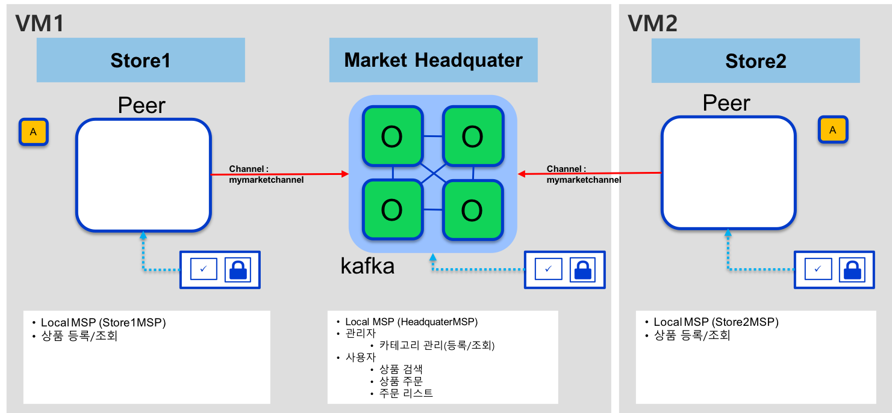
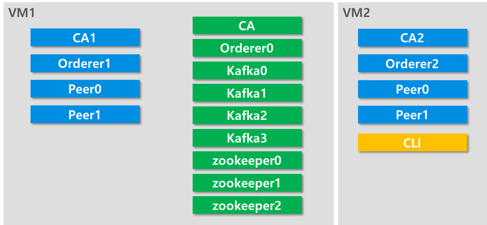

## Hyperledger Fabric을 이용한 상품 거래 시스템 개발

> 개발환경은 우분투 16.04 기반으로 테스트하여 작성하였습니다.

도메인 정보
* Headquater
   * mymarket.com
* Store1
   * store1.mymarket.com
* Store2
   * store2.mymarket.com
   
Ordering Service
* OrdererType : raftetcd
* Orderer
   * orderer.mymarket.com
   * orderer1.mymarket.com
   * orderer2.mymarket.com
   * orderer3.mymarket.com
   * orderer4.mymarket.com
   * orderer5.mymarket.com
   
   

아래 그림은 mymarket 실행을 위한 컨테이너 리스트 입니다.

### 사전 개발 환경 준비 (update 필요)
* Docker
    * 17.06.2-ce 이상
* Docker-compose
    * 1.14.0 이상 버전
* Golang
    * 1.10.x 버전 이상
* Nodejs
    * 8.x 버전
* NPM
    * 5.6
* 우분투
    * g++ 설치
    <pre><code>apt install g++</code></pre>
* Java
    * 1.8 이상
* Gradle

### 초기 환경 구성(Fabric 도커 이미지 다운로드)
~~~shell
./scripts/bootstrap.sh 1.4.3 -s
~~~

### Fabric 네트워크 실행
~~~shell
export COMPOSE_PROJECT_NAME=test
docker-compose up -d
~~~

### Fabric 네트워크 설정
~~~shell
docker exec -it cli bash
~~~
cli 컨테이너 접속 후 다음 명령 실행

~~~shell
./scripts/script.sh $CHANNEL_NAME 10 10
~~~

### app 실행
##### Store1 실행
~~~shell
cd app/store1
npm start
~~~

##### Store2 실행
~~~shell
cd app/store2
gradle bootJar
java -jar build/libs/store2-1.0-SNAPSHOT-boot.jar
~~~

### RestAPIs

##### store1

[GET] http://localhost:3000/store1/api/manager/product/:ID   
[GET] http://localhost:3000/store1/api/manager/product/all   
[POST] http://localhost:3000/store1/api/manager/product   
    - body(json) : {"name":"productName","qty":"100","owner":"store1"}

##### store2
[GET] http://localhost:8080/api/manager/product/:ID   
[GET] http://localhost:8080/api/manager/product/all   
[POST] http://localhost:8080/api/manager/product   
    - body(json) : {"name":"productName","qty":"100","owner":"store2"}